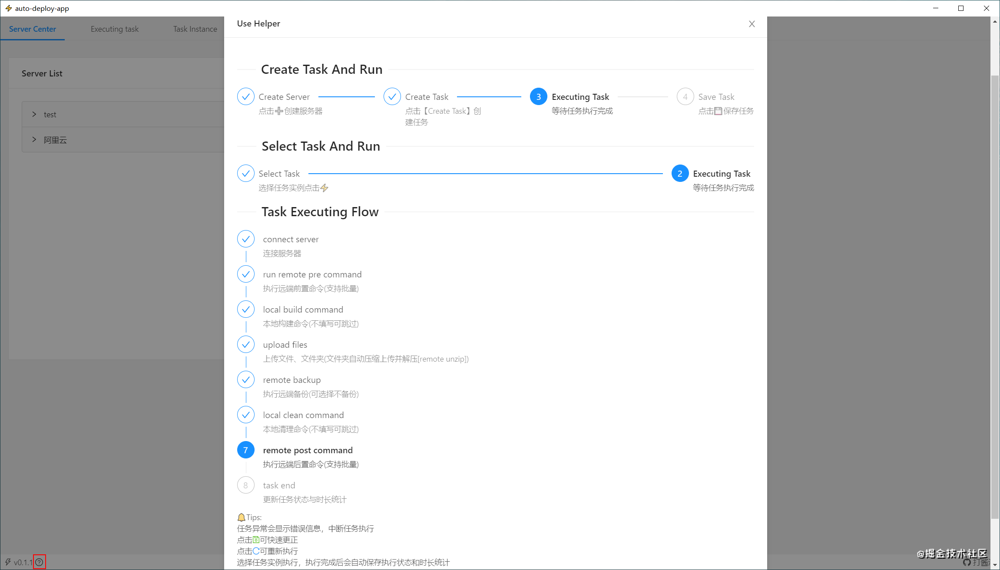
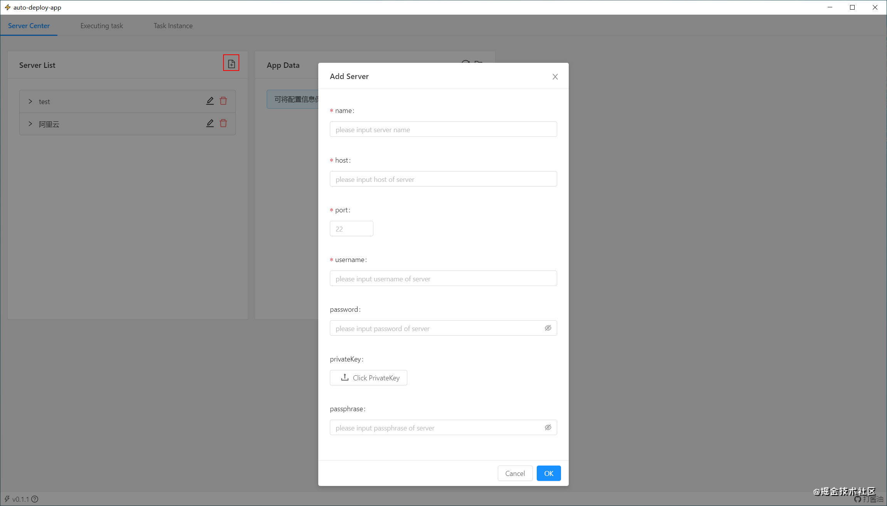
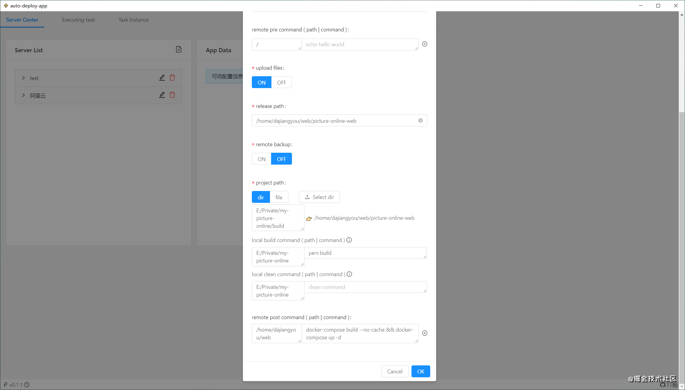
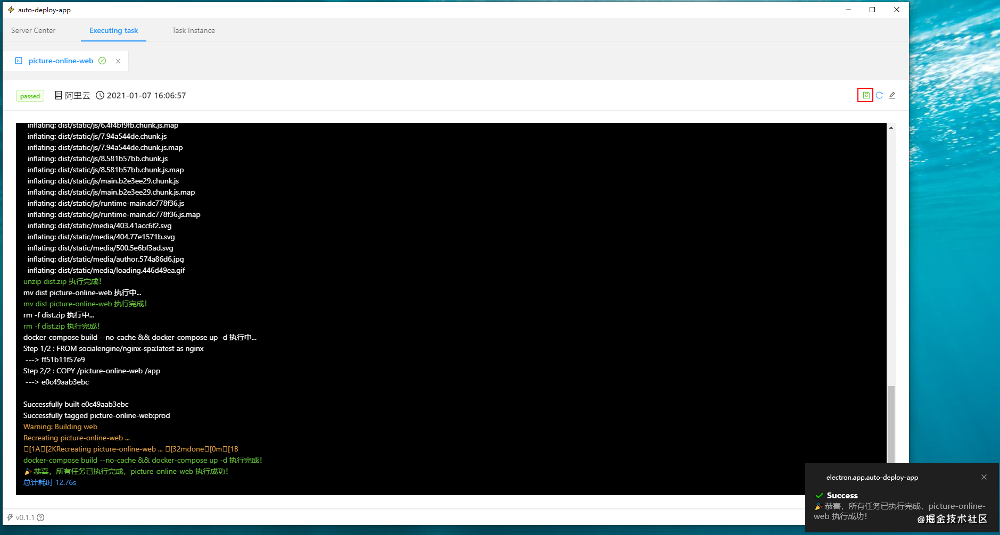

# auto-deploy-app

> An electron-vue app about auto deploy
> 
> The project is being continuously updated. Please submit PR and issues😘
> 
> Power Design By 打酱油

[Download](https://github.com/aotianwinter/auto-deploy-app/releases)

## 新版升级点
- 提供**可视化界面**，操作便捷
- 支持**服务器、执行任务、任务实例**的统一管理
- 支持任务实例的**快速修改、并行执行、重试、保存**
- 支持更加友好的信息展示（如：**任务耗时统计、任务状态记录**）
- 支持上传**文件、文件夹**
- 支持自定义本地**编译、清理命令**
- 支持**远端前置命令、后置命令**批量顺序执行
- 支持仅执行**远端前置命令**，用于触发某些自动化脚本

## How to use
### 查看使用帮助
- 点击查看使用帮助


### 创建任务并执行
- 创建服务器（支持密码、密钥）


- 点击`Create Task`创建任务（本地编译-->上传文件夹-->编译并启动容器）


- 任务结束后可保存


### 执行保存的任务实例
- 选择需要的任务点击运行


## Build Setup

``` bash
# install dependencies
npm install

# serve with hot reload
npm run dev

# build electron application for production
npm run build
```
